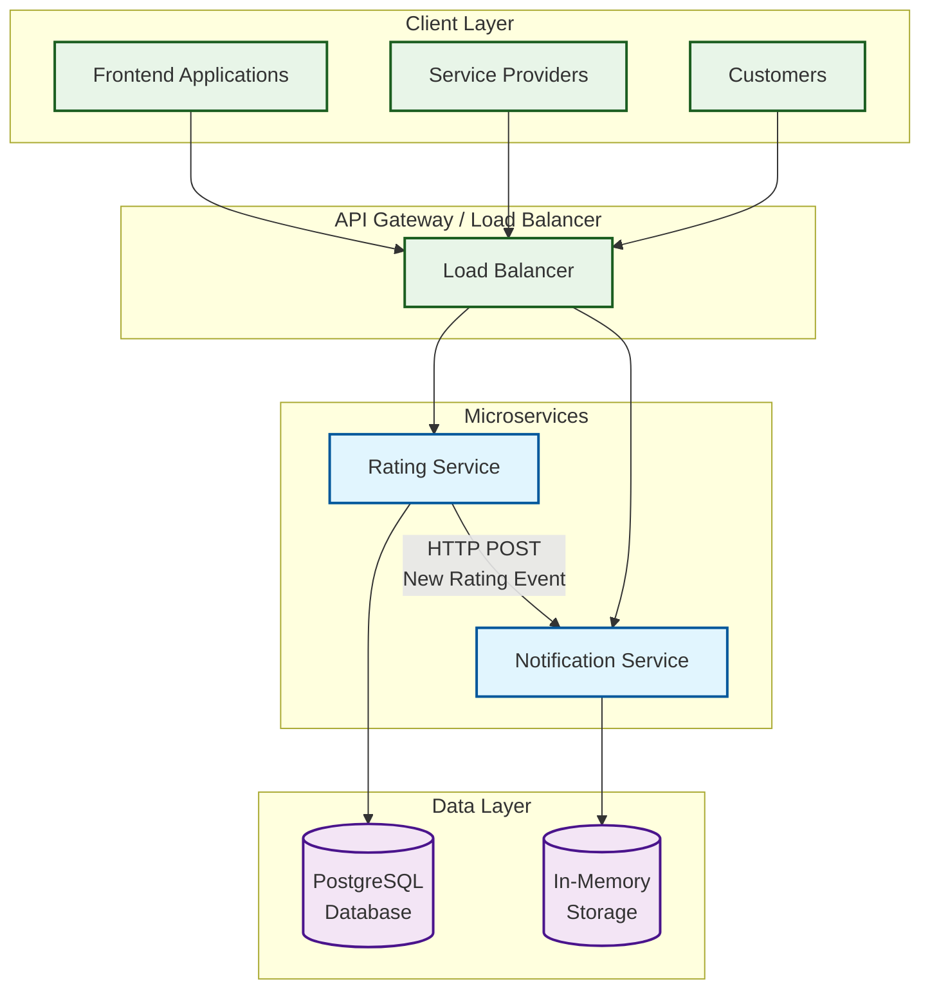

# Homerun Ratings System

A microservices-based service marketplace that enables Customers to rate Service Providers and notifies Service Providers when new ratings are added. Service Providers can also retrieve their average ratings from rating service and notifications from notification service .
## Main Decisions
- **Microservices Architecture**: The system is designed as a collection of microservices, each responsible for a specific domain, such as ratings and notifications.
- **HTTP REST API**: The services communicate over HTTP using RESTful APIs, allowed me for easy integration, easily testable and simplicity.
- **PostgreSQL**: The rating-service uses PostgreSQL as the primary database for storing ratings. My previous experience led me to choose PostgreSQL has shown its reliability and performance for such use cases and your stack also use AWS Aurora PostgreSQL.
- **In-Memory Storage**: The notification service uses in-memory storage for fast access to notifications, ensuring quick response times for service providers and simplicity. This also enables data persistence is not critical for notifications, as they can be regenerated from the rating service + low latency required.
- **Split Linting and Building in build.yml**: Parallel linting and building tasks are defined in `build.yml` to ensure code quality and efficient builds.
- **Go on both microservices**: Both system is implemented in Go, ease of deployment. Optimal for high-throughput, concurrent operations, and lightweight services. Native support for concurrent operations and channels. I got expertise in one language rather than surface knowledge of two.
- **Retry and Circuit Breaker Pattern**: The notification httpclient implements a retry mechanism with exponential backoff with jitter and a circuit breaker pattern to handle failures gracefully when sending notifications to the notification service. Makes the system more resilient to temporary failures and reduces the risk of overwhelming the notification service with requests.


[](http://godoc.org/github.com/berkaykrc/homerun-ratings-system)
[](https://github.com/berkaykrc/homerun-ratings-system/actions?query=workflow%3Abuild)

## Getting Started

If this is your first time encountering Go, please follow [the instructions](https://golang.org/doc/install) to
install Go on your computer. The project requires **Go 1.23.0 or above**.

[Docker](https://www.docker.com/get-started) is also needed if you want to try the project without setting up your
own database server. The project requires **Docker 17.05 or higher** for the multi-stage build support.

After installing Go and Docker, run the following commands to start experiencing this project:
you can use either `make` or `docker-compose` to run the services. make sure you have `make` installed on your system. `make help` to find all available commands.
```shell
# Clone the repository
git clone https://github.com/berkaykrc/homerun-ratings-system.git
cd homerun-ratings-system

# Start both services with Docker Compose
docker-compose up --build or make start

# Or run services individually:
# Start PostgreSQL database
docker run --name homerun-postgres -e POSTGRES_DB=homerun_ratings -e POSTGRES_USER=postgres -e POSTGRES_PASSWORD=postgres -p 5432:5432 -d postgres13:alpine

# Run Rating Service
cd rating-service
make run

# Run Notification Service (in another terminal)
cd notification-service
make run
```

### Services and Endpoints

#### Rating Service (Port 8080)

- `GET /healthcheck`: Health check endpoint
- `POST /v1/customers`: Create a new customer
- `GET /v1/customers/:id`: Get customer details
- `POST /v1/service-providers`: Create a new service provider
- `GET /v1/service-providers/:id`: Get service provider details
- `POST /v1/ratings`: Submit a rating for a service provider
- `GET /v1/service-providers/:id/average-rating`: Get average rating for a service provider

#### Notification Service (Port 8081)

- `GET /healthcheck`: Health check endpoint for the notification service
- `GET /api/notifications/:serviceProviderId`: Get notifications for a service provider
- `POST /api/internal/notifications`: Internal endpoint for receiving notifications (called by Rating Service)

Try the URL `http://localhost:8080/healthcheck` or `http://localhost:8081/healthcheck` in a browser, and you should see something like `"OK vx.x.x"` displayed.

## Project Layout

The project uses the following project layout:

```
.
├── bin                      executable binaries when compiled
├── ratings-service          service for managing ratings
│   ├── cmd                  main applications of the project
│   ├── config               configuration files for different environments
│   ├── internal             private application and library code
│   │   ├── config           configuration library
│   │   ├── customer         customer feature
│   │   ├── serviceprovider  service provider feature
│   │   ├── notification     http client for sending the notification to notification service
│   │   ├── rating           rating feature
│   │   ├── entity           entity definitions and domain logic
│   │   ├── errors           error types and handling
│   │   ├── healthcheck      healthcheck feature
│   │   └── test             helpers for testing purpose
│   ├── migrations           database migrations
│   ├── pkg                  public library code
│   │   ├── accesslog        access log middleware
│   │   ├── graceful         graceful shutdown of HTTP server
│   │   ├── log              structured and context-aware logger
│   │   └── pagination       paginated list
│   └── testdata             test data scripts
└── notification-service     service for managing notifications
```
## Main decision why this project is organized mono-repo way?
- Easy to navigate and understand the codebase to review.
- Unified docker-compose file to run both services together.
- Shared documentation for both services in a single README file.

The top level directories `cmd`, `internal`, `pkg` are commonly found in other popular Go projects, as explained in
[Standard Go Project Layout](https://github.com/golang-standards/project-layout).

Within `internal` and `pkg`, packages are structured by features in order to achieve the so-called
[screaming architecture](https://blog.cleancoder.com/uncle-bob/2011/09/30/Screaming-Architecture.html). For example,
the `customer` directory contains the application logic related with the customer feature.

Within each feature package, code are organized in layers (API, service, repository), following the dependency guidelines
as described in the [clean architecture](https://blog.cleancoder.com/uncle-bob/2012/08/13/the-clean-architecture.html).

### Updating Database Schema

The project uses [database migration](https://en.wikipedia.org/wiki/Schema_migration) to manage the changes of the
database schema over the whole project development phase. The following commands are commonly used with regard to database
schema changes:

```shell
# Execute new migrations made by you or other team members.
# Usually you should run this command each time after you pull new code from the code repo.
make migrate

# Create a new database migration.
# In the generated `migrations/*.up.sql` file, write the SQL statements that implement the schema changes.
# In the `*.down.sql` file, write the SQL statements that revert the schema changes.
make migrate-new

# Revert the last database migration.
# This is often used when a migration has some issues and needs to be reverted.
make migrate-down

# Clean up the database and rerun the migrations from the very beginning.
# Note that this command will first erase all data and tables in the database, and then
# run all migrations.
make migrate-reset
```

### Managing Configurations

The application configuration is represented in `internal/config/config.go`. When the application starts,
it loads the configuration from a configuration file as well as environment variables. The path to the configuration
file is specified via the `-config` command line argument which defaults to `./config/local.yml`. Configurations
specified in environment variables should be named with the `APP_` prefix and in upper case. When a configuration
is specified in both a configuration file and an environment variable, the latter takes precedence.

The `config` directory contains the configuration files named after different environments. For example,
`config/local.yml` corresponds to the local development environment and is used when running the application
via `make run`.

Do not keep secrets in the configuration files. Provide them via environment variables instead. For example,
you should provide `Config.DSN` using the `APP_DSN` environment variable. Secrets can be populated from a secret
storage (e.g. HashiCorp Vault) into environment variables in a bootstrap script (e.g. `cmd/server/entryscript.sh`).

## Deployment

The application can be run as a docker container. You can use `make build-docker` to build the application
into a docker image. The docker container starts with the `cmd/server/entryscript.sh` script which reads
the `APP_ENV` environment variable to determine which configuration file to use. For example,
if `APP_ENV` is `qa`, the application will be started with the `config/qa.yml` configuration file.

You can also run `make build` to build an executable binary named `server`. Then start the API server using the following
command,

```shell
./server -config=./config/prod.yml
```
## Feature Improvements
* Load balancing and service discovery
* Rate limiting and throttling
* gRPC/Message Brokers or WebSockets(gorilla,melody) integration for asynchronous processing and better decoupling
* Enhanced security measures (e.g., authentication/authorization with JWT tokens)
* Monitoring and logging improvements (Grafana, Datadog, etc.)
* Redis can be used for caching notifications in the notification service instead of in-memory storage
* Implementing a more robust error handling and retry mechanism
* Implementing a more sophisticated notification system (e.g., email, SMS, push notifications)
* Could be used shared libraries for common functionalities (e.g., logging, error handling, etc.) if the project grows larger and not split into multiple repositories
* [Retry strategy can be improved with following article algoritms](https://aws.amazon.com/blogs/architecture/exponential-backoff-and-jitter/)
* [hystrix-go](https://github.com/afex/hystrix-go) can be used for notification send in httpclient circuit breaker pattern to handle failures gracefully instead of current retry mechanism or [heimdall](https://github.com/gojek/heimdall) which provides advanced resilience features (retries, circuit breakers, etc.) at one go also use hystrix-like pattern.
* Could be used maintaned web framework, routing like Gin, Gorilla Mux, Echo, etc. instead of ozzo-routing
* Could be used GORM instead for database operations instead of ozzo-dbx
* k6 or locust can be used for load testing the services
* Repository tests should run on test database instead of actual database with Testcontainers
* Pagination can be implemented for the rating service